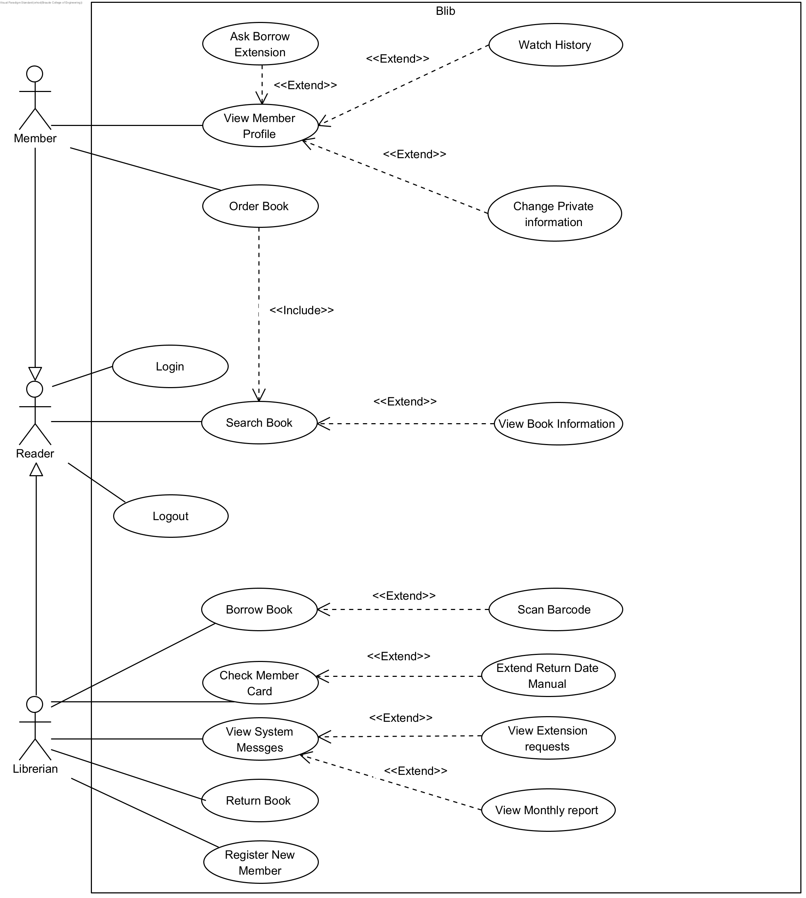

# BLib

Our project is a library management system, which includes both a client-side and server-side component. The server side connects to a database that stores user and library information.
## Description

BLib is an educational project focused on developing a full-stack system for managing a library. The system is written in Java, with a graphical user interface built using JavaFX. It connects to a MySQL database to manage user and library data, with database communication handled through JDBC. The client-server interaction is managed using OCSF.
## Models

### System Use Case

