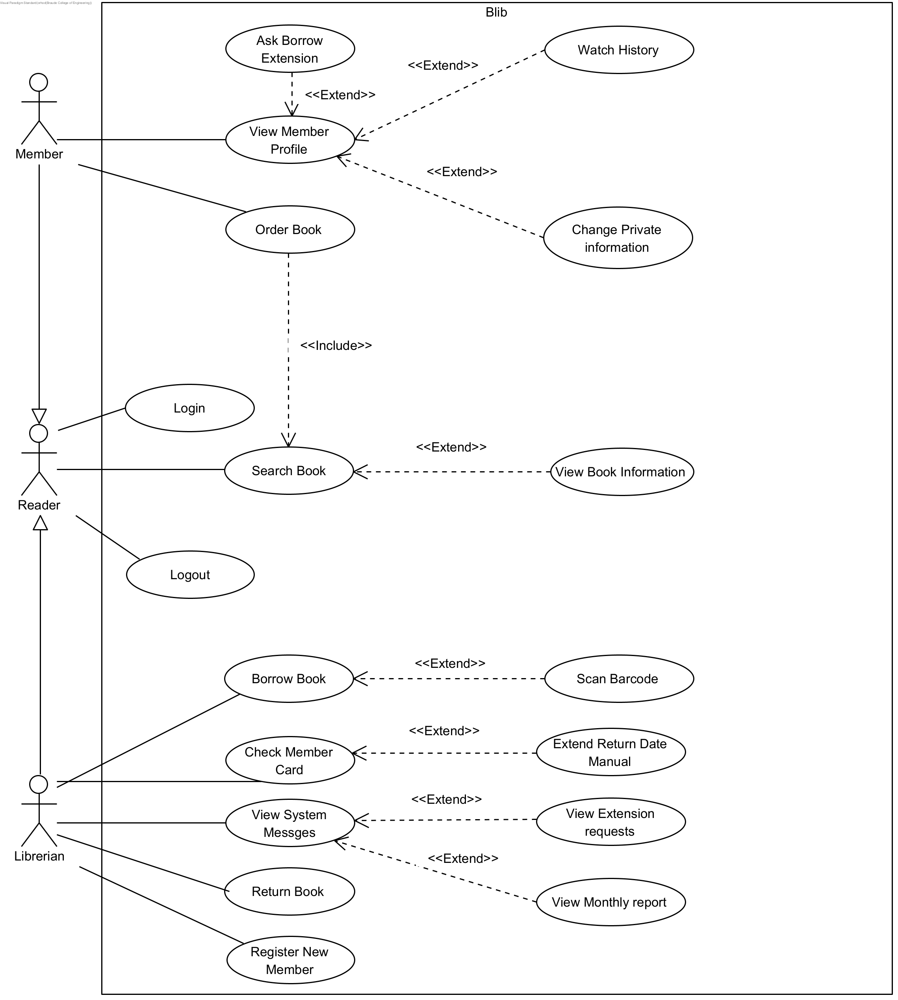

# BLib 📚

A client-server library management system, built as an educational full-stack project. The server connects to a MySQL database to store and manage library data (books, subscribers, librarians, loans, and reports); the client is a JavaFX desktop application librarians and subscribers use to interact with the system.

## Description

BLib is written in Java. The client uses JavaFX for its GUI (FXML views + controllers). Client-server communication is handled over a custom framework (OCSF — Object Client-Server Framework), and the server persists data in a MySQL database via JDBC. The server also sends email notifications (via `javax.mail`) for things like reservation and due-date alerts.

## 🎯 Features

- **Subscriber management** — register, search, view, and edit subscriber profiles
- **Book catalog & search** — search the catalog and view book details
- **Borrowing workflow** — borrow, return, and handle borrowed books
- **Reservations** — active reserves tracked and notified when a book becomes available
- **Librarian tools** — librarian login, monthly reports, subscriber history, messaging
- **Server monitor** — a JavaFX GUI on the server side to monitor connections and configure the listening port
- **Email notifications** — automated emails for library events (via `javax.mail`)

## 🏗️ Tech Stack

- **Language**: Java
- **Client GUI**: JavaFX (FXML + CSS)
- **Server GUI**: JavaFX
- **Client-Server Protocol**: OCSF (Object Client-Server Framework)
- **Database**: MySQL (via JDBC, `mysql-connector-java`)
- **Email**: `javax.mail`
- **Config**: `dotenv-java`

## 🏛️ System Overview



## 📁 Project Structure

```
Blib/
├── Diagrams/
│   └── UseCase.png                 # System use-case diagram
├── FinalProject/
│   ├── Client/
│   │   └── src/
│   │       ├── common/             # Shared data/message classes
│   │       ├── gui/                # FXML views, CSS, controllers
│   │       ├── logic/               # ClientController
│   │       ├── main/                # ChatClient entry point
│   │       └── resources/           # Images/icons
│   ├── Server/
│   │   └── src/
│   │       ├── common/             # Shared data/message classes
│   │       ├── gui/                # Server monitor UI
│   │       ├── logic/               # DBController, NotificationController, ScheduleController, ServerController
│   │       └── main/                # ServerGUI entry point
│   └── OCSF/                       # Object Client-Server Framework library
└── README.md
```

## 🚀 Getting Started

### Prerequisites

- Java JDK 11+ (JavaFX-compatible)
- Eclipse IDE (project ships with `.project` / `.classpath` files) or another Java IDE with JavaFX support
- MySQL Server
- The JavaFX SDK configured on your build path

### Installation

```bash
git clone https://github.com/Engineering-Methods-Course/Blib.git
```

Import `FinalProject/OCSF`, `FinalProject/Server`, and `FinalProject/Client` as existing projects in Eclipse (each has its own `.project`/`.classpath`). Build `OCSF` first, since both `Client` and `Server` depend on it.

### Database Setup

1. Create a MySQL database for the project and load the library schema (users, subscribers, books, loans, reports).
2. Configure DB connection details (host, user, password, schema) as expected by `Server/src/logic/DBController.java`, either directly or via a `.env` file consumed with `dotenv-java`.

### Running

1. **Start the server**: run `Server/src/main/ServerGUI.java`. Set/confirm the listening port from the Server Port frame.
2. **Start the client**: run `Client/src/main/ChatClient.java`, pointing it at the server's IP/port.
3. Log in and interact with the system (search, borrow/return books, manage subscribers, generate reports) from the client GUI.

## 🔧 Configuration

- Server DB credentials: configured via `dotenv-java`/`DBController` — do not commit real credentials.
- Email sending (`javax.mail`): configure SMTP credentials used by `NotificationController`.

## 🤝 Contributing

1. Fork the repository
2. Create a feature branch (`git checkout -b feature/amazing-feature`)
3. Commit your changes (`git commit -m 'Add amazing feature'`)
4. Push to the branch (`git push origin feature/amazing-feature`)
5. Open a Pull Request

## 📄 License

Educational project — no license specified. Contact the maintainers before reuse.

## 🙏 Acknowledgments

Built with OCSF (Object Client-Server Framework) for the client-server layer, and JavaFX for the GUI.
